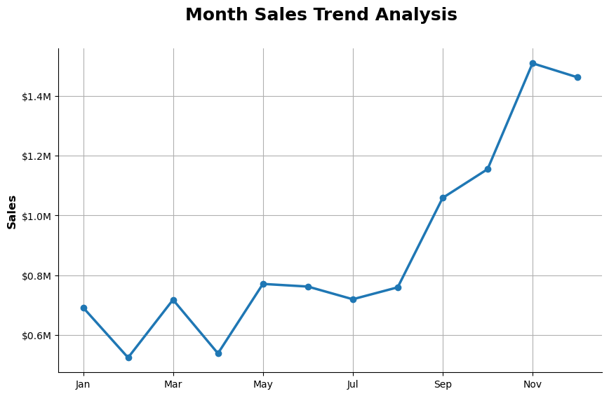
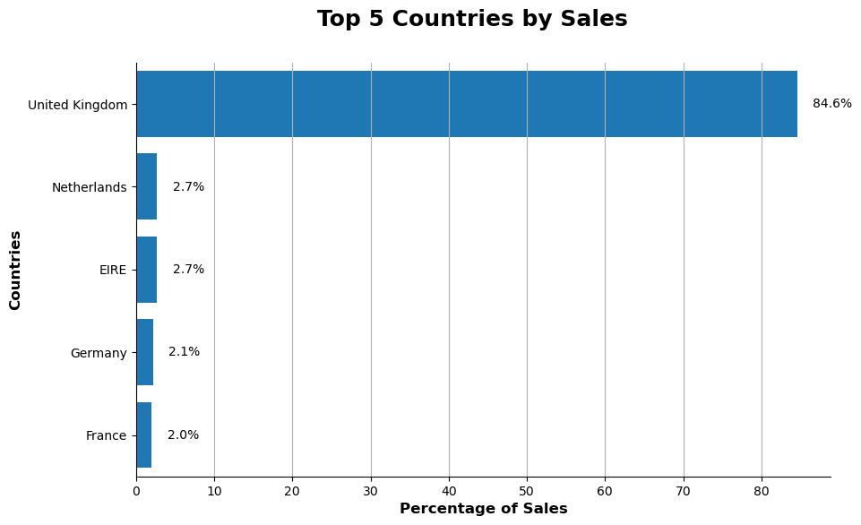
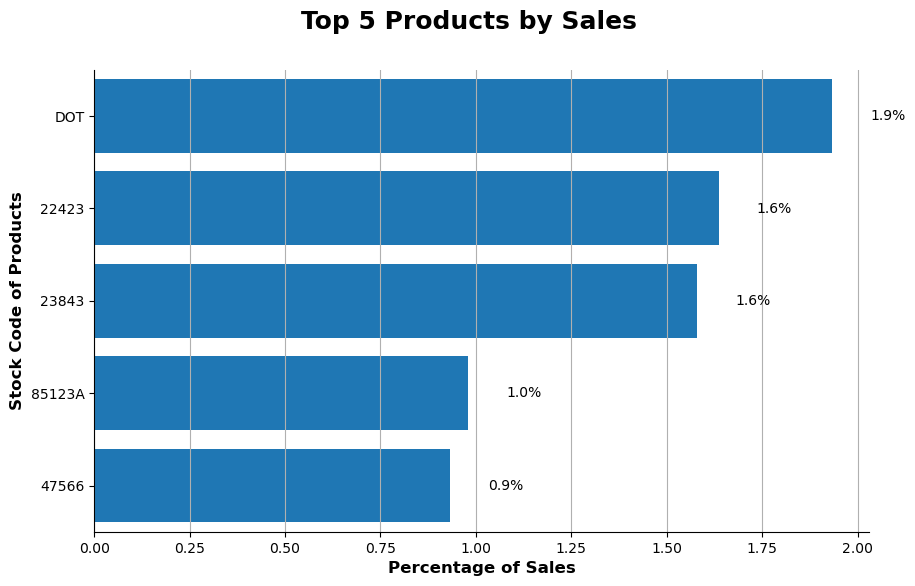
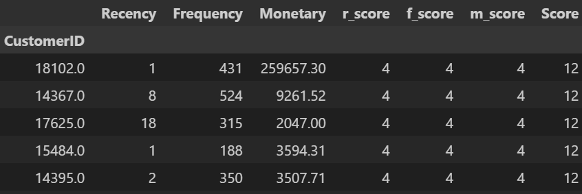
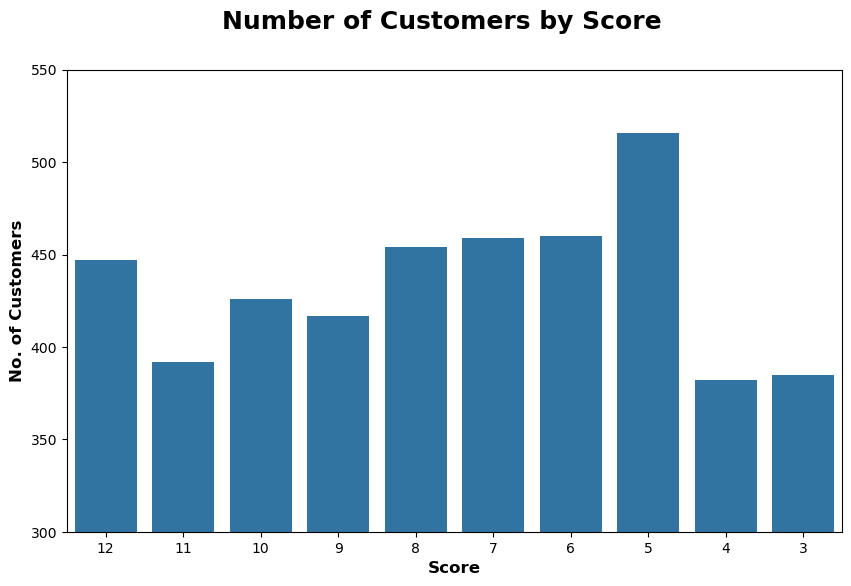
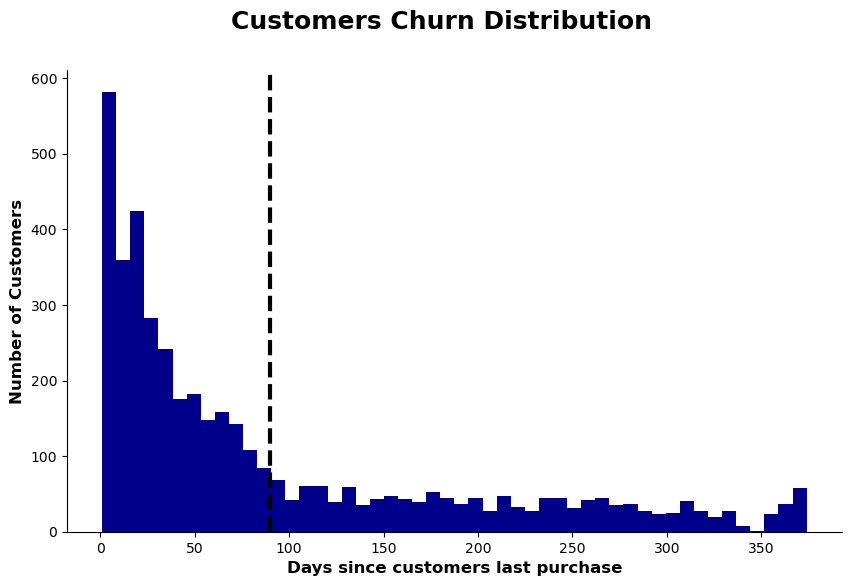

# Python Project on Retail Analysis
A Data Analysis Project for Uncovering Consumer Trends to Drive Retail Strategy.

## Overview
This retail analysis project aims to provide a comprehensive understanding of business performance and customer behavior through data-driven insights. It includes the exploration of monthly sales trends, identification of top-performing countries and best-selling products, as well as advanced customer segmentation using RFM (Recency, Frequency, Monetary) analysis. Additionally, churn analysis is conducted to detect patterns in customer retention and attrition. The goal of this project is to help stakeholders better understand key drivers of sales and customer value, enabling informed decision-making for growth and optimization.


## Data Description
The dataset used in this project was sourced from Code Basics Python project, containing product details with the following columns:

Invoice No.
Stock Code
Description
Quantity
Invoice Date
Unit Price
Customer ID
Country

## Question Explored:

1. **What are the monthly sales trends, and how do they reveal seasonal or behavioral patterns?**
2. **Which countries contribute the most to overall sales, and what does that indicate about market performance?**
3. **What are the top-selling products, and how can this inform inventory and marketing strategies?**
4. **How can RFM (Recency, Frequency, Monetary) analysis help us identify high-value customer segments?**
5. **What does churn analysis reveal about customer retention, and how can it guide retention efforts?**


## Data Preparation and Cleanup:

This step involves data preparation, including importing libraries, loading the dataset, and performing essential cleanup to ensure the data is ready for analysis.

### Import Libraries and dataset
I started wwith loading neccesary libraries and dataset.

```python
import pandas as pd
from datasets import load_dataset
import matplotlib.pyplot as plt 
import seaborn as sns

#loading dataset
data = pd.read_excel("D:/python/project 3/Online Retail.xlsx")

#converting data types
df['InvoiceNo'] = df['InvoiceNo'].astype('string')

df[['StockCode', 'Description', 'Country']] = df[['StockCode', 'Description', 'Country']].astype('string')

#cleanup (assigning correct description)
mostfreq = df.groupby('StockCode')['Description'].value_counts().reset_index()
mostfreq = mostfreq.sort_values(by='count', ascending=False)

mostfreq = mostfreq.groupby('StockCode').head(1)
df2 = df.merge(mostfreq, on='StockCode', how='left')

df2['Description_x'] = df2['Description_y']
df2.dropna(subset='Description_x', inplace=True)
df2.drop(columns=['Description_y', 'count'], inplace=True)

# Cleaning Column name
df2.columns = ['InvoiceNo', 'StockCode', 'Description', 'Quantity', 'InvoiceDate',
       'UnitPrice', 'CustomerID', 'Country']

# Removing negative values
df3 = df2[(df2['Quantity']>0) & (df2['UnitPrice']>0)]

# Adding essential columns
df3['Total_Sales'] = df3['Quantity'] * df3['UnitPrice']
df3['Month'] = df3['InvoiceDate'].dt.month
df3['Short_Month'] = df3['InvoiceDate'].dt.strftime('%b')

```

## Analysis:

I approached each question using Jupyter Notebooks, performing data cleaning, EDA, and visualizations to provide meaningful insights and support data-driven conclusions.

### 1. **What are the monthly sales trends, and how do they reveal seasonal or behavioral patterns?**
This analysis focuses on evaluating monthly sales performance to identify recurring patterns, seasonal peaks, and potential downturns in customer activity. By visualizing sales data over time, the goal is to uncover key trends that influence revenue, helping businesses anticipate high-demand periods, optimize inventory, and align marketing strategies with customer buying behavior.

Check out my notebook for detailed steps: 
[Retail_analysis](Retail_Analysis.ipynb)

#### Visualizing the data
```python
fig, ax = plt.subplots(figsize=(10,6))
monthsales.plot(kind='line', x='Short_Month', y='Total_Sales', linewidth=2.5, marker='o', ax=ax)
ax.yaxis.set_major_formatter(plt.FuncFormatter(lambda x, _: f'${x/1000000}M'))
plt.suptitle('Month Sales Trend Analysis', fontsize=18, fontweight='bold')
plt.xlabel('')
plt.ylabel('Sales', fontsize=12,fontweight='bold')
plt.grid()
ax.get_legend().remove()
sns.despine()
```


#### Results



#### Insights

1. **Significant Q4 Sales Surge:**
   Sales show a dramatic increase starting in September, peaking in November at over \$1.5M. This suggests strong seasonal demand—likely driven by holiday shopping or end-of-year promotions.

2. **Stable but Modest Sales in Q1–Q2:**
   From January to June, sales remain relatively flat, fluctuating between \$0.5M and \$0.8M, indicating a period of steady but unspectacular performance.

3. **Mid-Year Dip and Recovery:**
   A slight dip in July is followed by consistent upward growth from August onwards, possibly indicating the success of pre-fall campaigns or back-to-school sales momentum.

4. **Strategic Planning Opportunity:**
   The clear seasonality observed highlights an opportunity to align inventory, staffing, and marketing strategies with anticipated high-demand months (especially Q4) to maximize revenue.

### 2. **Which countries contribute the most to overall sales, and what does that indicate about market performance?**
This analysis focuses on evaluating the contribution of different countries to total retail sales, with a specific visualization of the top five countries by percentage share. By identifying the highest-performing markets, the goal is to uncover geographical trends in consumer demand and purchasing power. This helps in understanding regional performance, guiding market-specific strategies, and identifying opportunities for expansion or optimization in underperforming regions.

Check out my notebook for detailed steps: 
[Retail_analysis](Retail_Analysis.ipynb)

#### Visualizing the data

```python
fig, ax = plt.subplots(figsize=(10,6))
percentage.plot(kind='barh', ax=ax)
bars = ax.barh(percentage.index, percentage.values)
ax.invert_yaxis()

for bar, percent in zip(bars, percentage.values):
    ax.text(bar.get_width() + 2, bar.get_y() + bar.get_height()/2, f'{percent:.1f}%', va='center')
plt.suptitle('Top 5 Countries by Sales', fontsize=18, fontweight='bold')
plt.xlabel('Percentage of Sales', fontsize=12,fontweight='bold')
plt.ylabel('Countries', fontsize=12,fontweight='bold')
plt.grid(axis='x')
sns.despine()
```

#### Results



#### Insights

1. **Dominance of the United Kingdom:**
   The United Kingdom accounts for **84.6%** of total sales, indicating a highly concentrated market. This suggests that most of the business revenue is driven by a single country, highlighting its strategic importance.

2. **Minimal Contribution from Other Countries:**
   Each of the remaining top countries (Netherlands, EIRE, Germany, France) contributes less than **3%** individually. This shows a significant disparity in sales distribution and potential overdependence on the UK market.

3. **Expansion Opportunity in European Markets:**
   The low sales percentages in non-UK countries suggest untapped potential. Targeted marketing, localized product offerings, or logistical improvements could help boost sales in these regions.

4. **Risk Consideration in Market Concentration:**
   Heavy reliance on the UK market poses a business risk in case of economic shifts, regulatory changes, or disruptions. Diversifying the customer base across more countries could mitigate this risk.

### 3. **What are the top-selling products, and how can this inform inventory and marketing strategies?**
This analysis focuses on identifying the top five best-selling products based on their percentage contribution to total sales, using stock codes as unique identifiers. By visualizing product performance in a horizontal bar chart, the goal is to uncover sales concentration patterns and understand customer preferences. These insights support data-driven inventory planning and targeted marketing strategies to boost sales and reduce stockouts or overstocking.


Check out my notebook for detailed steps: 
[Retail_analysis](Retail_Analysis.ipynb)

#### Visualizing the data

```python
fig, ax = plt.subplots(figsize=(10,6))
productper.plot(kind='barh', ax=ax)
bars1 = ax.barh(productper.index, productper)
ax.invert_yaxis()

for bar, percent in zip(bars1, productper.values):
    ax.text(bar.get_width() + 0.1, bar.get_y() + bar.get_height()/2, f'{percent:.1f}%', va='center')
plt.suptitle('Top 5 Products by Sales', fontsize=18, fontweight='bold')
plt.xlabel('Percentage of Sales', fontsize=12,fontweight='bold')
plt.ylabel('Stock Code of Products', fontsize=12,fontweight='bold')
plt.grid(axis='x')
sns.despine()

```

#### Results



#### Insights

1. **High Concentration of Sales in Top Products**
   The top five products together contribute a noticeable share of total sales, with the leading product alone (Stock Code: `DOT`) accounting for **1.9%**. This indicates that a small subset of products drives a disproportionate amount of revenue.

2. **Top Two Products Have Comparable Performance**
   Products `22423` and `23843` are nearly tied in sales contribution (both at **1.6%**), suggesting potential overlap in customer demand or product appeal. This could be leveraged for targeted promotions or bundling.

3. **Product `DOT` Stands Out**
   With the highest percentage of sales (1.9%), product `DOT` significantly outperforms the others. This may indicate a flagship product or a strong brand identity associated with it, deserving focused inventory management and marketing.

4. **Long-Tail Products Still Matter**
   Even products lower on the top-5 list, like `47566` and `85123A`, contribute meaningfully (0.9% and 1.0%). This emphasizes the importance of maintaining variety to support overall revenue through a diversified product portfolio.

### 4. **How can RFM (Recency, Frequency, Monetary) analysis help us identify high-value customer segments?**
This analysis segments customers based on their purchase behavior using the RFM (Recency, Frequency, Monetary) model. It helps businesses identify high-value customer groups by scoring each customer on:

Recency – How recently a customer made a purchase. Customers with more recent purchases receive higher scores, indicating ongoing engagement.

Frequency – How often a customer makes a purchase. Frequent buyers are scored higher as they demonstrate consistent buying behavior.

Monetary – How much money a customer has spent. Customers with higher total spend are given higher scores, showing their value to the business.

Each customer receives a score from 1 to 4 in each category (with 4 being the best), resulting in a total RFM score ranging from 3 to 12. A score of 12 identifies a top-tier, high-value customer—someone who purchases often, recently, and spends the most.

The results are visualized using a bar chart that highlights the distribution of customers across different RFM scores. This helps businesses tailor marketing strategies, prioritize loyalty efforts, and drive revenue by focusing on their most valuable customer segments.

Check out my notebook for detailed steps: 
[RFM_analysis](Retail_Analysis2.ipynb)

#### Segmenting the data

```python
rfm = df3.groupby('CustomerID').agg({
    "InvoiceDate" : lambda x : (cureentdate - x.max()).days,
    "InvoiceNo" : 'count',
    "Total_Sales" : 'sum'
})
rfm.columns = ['Recency', 'Frequency', 'Monetary']

rfm['r_score'] = pd.qcut(rfm['Recency'], 4, (4, 3, 2, 1))
rfm['f_score'] = pd.qcut(rfm['Frequency'], 4, (1, 2, 3, 4))
rfm['m_score'] = pd.qcut(rfm['Monetary'], 4, (1, 2, 3, 4))
rfm['Score'] = rfm[['r_score', 'f_score', 'm_score']].sum(axis=1)

ranked_customers = rfm.sort_values(by='Score', ascending=False)
```

#### Results



#### Visualizing the data
 
 ```python
customersloyalty = ranked_customers.reset_index()

customersloyalty1 = customersloyalty.groupby('Score')['CustomerID'].count()

fig, ax = plt.subplots(figsize=(10,6))
sns.barplot(data=customersloyalty1, ax=ax)
ax.invert_xaxis()
plt.ylim(300,550)
plt.suptitle('Number of Customers by Score', fontsize=18, fontweight='bold')
plt.xlabel('Score', fontsize=12,fontweight='bold')
plt.ylabel('No. of Customers', fontsize=12,fontweight='bold')
 ```

#### Results



#### Insights

1. **High-Value Customers Are a Strong Segment**
   A significant number of customers (over 440) have the highest RFM score of **12**, indicating a solid base of highly engaged and valuable customers who purchase frequently, recently, and spend the most.

2. **Score 5 Has the Highest Customer Count**
   The largest customer group has a total score of **5**, suggesting a high volume of low- to mid-engagement customers. These may need re-engagement strategies to move them toward higher-value behavior.

3. **Balanced Distribution with a Mid-Segment Opportunity**
   Scores from **6 to 10** have a fairly even customer distribution, showing potential for **nurturing mid-value customers** into high-value segments through targeted offers or loyalty programs.

4. **Low-Scoring Customers Still Present**
   Customers with scores **3 and 4** still exist in decent numbers. These may represent new, inactive, or disengaged customers, highlighting a need for retention or win-back campaigns.

### 5. **What does churn analysis reveal about customer retention, and how can it guide retention efforts?**
This analysis focuses on identifying churned customers—those who have not made a purchase within a defined period. In this case, I’ve set the churn threshold at 90 days, meaning any customer who hasn’t bought anything in the last 90 days is considered churned.

By analyzing the number of days since each customer's last purchase, the goal is to understand customer inactivity patterns and predict potential churn. The results are visualized using a histogram, making it easy to observe how customer engagement drops over time. This insight is essential for designing retention strategies, reactivation campaigns, and improving customer lifetime value.

Check out my notebook for detailed steps: 
[Churn_analysis](Retail_Analysis2.ipynb)


#### Visualizing the data

```python
fig, ax = plt.subplots(figsize=(10,6))
customers_last.plot(kind='hist', bins=50,color='darkblue', ax=ax)
plt.axvline(churn_limit, linestyle='--', linewidth=3, color='black')

plt.suptitle('Customers Churn Distribution', fontsize=18, fontweight='bold')
plt.xlabel('Days since customers last purchase', fontsize=12,fontweight='bold')
plt.ylabel('Number of Customers', fontsize=12,fontweight='bold')
sns.despine()
```

#### Results



#### Insights

1. **High Volume of Recently Active Customers**
   A majority of customers made a purchase within the last 30 days, as shown by the sharp peak on the left side of the histogram. This suggests strong short-term engagement and frequent purchasing behavior.

2. **Churn Threshold Clearly Defines Inactive Segment**
   The 90-day churn threshold (marked by the dashed line) effectively separates active and inactive customers. After this point, the number of customers drops significantly, indicating potential churn.

3. **Long Tail of Churned Customers**
   Beyond 90 days, the customer count decreases gradually but remains steady across time, suggesting a long tail of disengaged customers who may still be reactivated with targeted campaigns.

4. **Critical Window for Retention**
   The steep decline between 30–90 days highlights a **critical window** for customer retention efforts. Engaging customers during this period can prevent them from becoming inactive and reduce churn rates.

## TOOLS USED:

- **Python** – The core programming language for data analysis and manipulation.  

 **LIBRARIES** 

 *Pandas* – Used for data cleaning, transformation, and analysis.  
*Matplotlib* – Employed for creating detailed and customizable visualizations.  
 *Seaborn* – Utilized for advanced statistical and aesthetically appealing data visualizations.  
- **Jupyter Notebooks** – The tool I used for writing, testing, and visualizing Python code.  
- **VS Code** – Software I used for writing and running python scripts.  
- **GitHub** – Used for version control and sharing project code.  
- **Dataset Source** – Data obtained from Code Basics Youtube channel.

## Conclusion

This retail analysis project provides valuable insights into customer behavior, product performance, and sales trends, enabling data-driven decision-making for retail strategy and growth. By examining monthly sales trends, the analysis highlights peak performance periods and helps in seasonal demand planning. Identifying the top countries by sales uncovers key markets, guiding international marketing and logistics strategies.

The evaluation of top-selling products reveals what drives revenue, aiding in inventory management and promotional planning. The RFM analysis segments customers by their purchasing habits, helping businesses target high-value customers more effectively and build personalized engagement strategies. Additionally, the churn analysis identifies patterns of customer inactivity, offering critical insights for developing retention and reactivation campaigns. Potentially suggesting to introduce loyalty programmes.

Overall, this project is useful for stakeholders seeking to optimize marketing, improve customer loyalty, and increase profitability through a deeper understanding of retail dynamics.
